# react_JS
Basics &amp; Theory and testings 
- Explanation about React Native -line 60
- Redux : line 97
- Learning and using Tailwind css frameworks. 

## What is React?

- React is a Javascript library for building user interface & helps to build single page applications.
- React allows us to create reusable UI components.

## Why is reactJS?

- React uses virtual DOM which is a JSObject. This will improve apps performance, since JS virtual DOM is faster than the regular DOM.
- Little to no breaking changes. -> one version to new version upgrading the code will not break.
- Virtual DOM is representation of the actual DOM.

## What is component?

- House: Bricks, Door, windows,... ReactJS - combine of lot of components.
- JSX -> Javascript XML Class => 

## What is JSX?

- JSX stands for JS XML. Babel is a JS compiler that includes the ability to compile JSX into regular JS.
-  http://babeljs.io/repl
* -  JSX => 
<h1>Shopping List for {this.props.name}</h1><ul><li></li></ul>

- Babel compiler JSX -> javascript

## What is Virtual DOM?

- Live actual DOM, virtual DOM is a node tree that lists the element and their attributes and content as 
- Objects and their properties. React render function create a node tree out of react component. then it's
- update this tree in response to the mutation in data model, caused by various actions done either by user
- or system.  
- Virtual DOM works in three steps: Whenever underline data changes the entire UI rerender in virtual DOM
- representation. Then the difference between the previous DOM representation and new one is calculated. 
- Once the calculation are done. The real DOM will be updated only with the thing actually changed. 
- This makes our application much faster and there's no memories wasted.

## Components Types

- Class Components
- Functional Components

## Important things to remember in React

- Functional programming : functional comp. is light weighted and ease to read and create
- Immutability : Arr or Obj changing not only the value, also the variable it self.
- Testability React views can be used as function of the state. State is an object with an mind 
- How a component will render and behavior. Thats we easily can manipulate with state of components
- which we passed to react view and take a look at the output and trigger action events, functions, ...
- This makes react application quite easy to test and debug.
- Server Side Rendering: allows you to pre render initial state by react components at server side only.
- With SSR the server response to the browsers, becomes only HTML of the page which is now to ready to 
- rendered. That's the browser can now start rendering without having to wait for all the JS to be loaded 
- and executed as a result webpage load faster. The user able to see the real webpage, while react still 
- downloading the js creating a virtual DOM linking events ,... in the backend.
- In One-way data binding, data flows in a single direction ie from the models ro the views. 
- increase the efficiencies.

## What is React native?

- React Native is a cross-platform mobile application development framework that uses JS as its base languages.
- React Native architecture heavily relive JS run time architecture also knowns as JS bridge.
- Write once use everywhere. working on multiple platforms. 
- React Native allows you to add plugins and third part packages.
- Live reload, cost efficient testing using tools such as Jest.

 ## React VS React Native?

 - React is used to develop Web Application. React Native for Mobile Application development.
 - React: Facebook, Netflix, NewYorkTimes, YahooMail
 - React Native: Instagram, Facebook ads manager.
 - React Natives comes with all the essentials required to build the application.
 - React is library of JS. When we use react requires multiple tools for setup and building.
 - React does not support live reload.
 - React native have ready mate components, react we need ti code ourself.

 ## React VS React Native in code?

 - React more like HTML div, h1, p => Native: View, Text, Text.
 - we need to import it from react-native. {View, Text};
 - to make difference between h1 and p, we need to styling. 
 - style: div style={{height: '25px', display: 'flex', flexDirection: 'column'}}, Native : style={{height: 
 - 25, weight: 100}}, can't use any HTML.
 - In Native we don't use units px, pt, em.
 - Native is flex is default. So we don't need to use it.
 - Native have custom components Svg, path from react-native-svg.

 ## React and React Native similarities. 

 - Logic and state Management are same.  State, hooks, context api, redux, props, render props, 
 - higher order component. 
 - check Expo.io

## Redux

- Redux is a library in JS world. At a super-high level, Redux is a tool that developers use to make their 
- lives easier to architect an application. Complexity is smaller and
- As many of you might have heard its job is "state management."
- Example: a component hierarchy: shot - shotdetail - title - image -> If a data require in image. 
- parent(shot)- child(shotdetail) - title(nested child) - then date will go to the least component(img).
- We share that data with routing or props with difficulties to give it to img.
- With redux we can supply any data directly to any component. - first advantage.
- Server side communication is really important. we take one by one from data. with using redux 
- we can handel data in bulk operation. Superstore. Data is easy to manage and distribute it.
- Redux concept: Components - dispatch a certain thing -  Action - reach the reducers , has the power to 
- change something - central store which is manage all the state of the application and once that changed -
- they actually send a trigger - subscriptions - passes updated states as props - to the component. 

## MVC VS FLUX vS Redux

- MVC : Model View Controller : Architectural design pattern for developing UI.
- Model where is our Business logic, View where is our UI, Controller control model and view.
- Flux : Application architecture designed ro built client-side web apps. A design pattern
- Redux : Open-source JS library used for creating the UI. It generally allows with React & angular 
- development. The redux takes the idea of flux design pattern and creating an Open-source library.
- Redux can be used in React, angular in other library(JS).
- With learning flux, we can also built similar like redux. 
- Structure and Data Flow of Flux : Action - Dispatcher - store - View. same as redux.
- The advantage of Redux library is lightweight. 4kb. 
- Flux is a design pattern invited by Facebook. With using Redux achieve the design pattern quickly. 

## What problem does Redux solve? 

- Basically we use props to share data. Take the data from the server side, we can share that parent to 
- child. So Props or state we'll use. The complexity are we need to manage a lot of state or use props
- handel in many places. 

## Fundamental principles of Redux

- Single source of truth: The state of your whole application is stored in an object tree within a single 
- <u>store</u>. The state inside our application redux will takeover and follow those state.
- The state is read-only: The only way to change the state is to emit an <u>action</u>, an object describing what 
- happened. (Redux won't modify your state, it'll read and emit if we give an assignment.)
- Changes are made with pure functions: To specify how the state tree is transformed by actions, you write 
- pure <u>reducers</u>. (if you change something by only basic JS functionality).
- without redux will react writing code will be poor practice. nested class collect data from directly 
- with parent class.
- > Redux offers a solution of storing all your application state in one place, called a "store". Components then "dispatch" state changes to the store, not directly to other components. The components that need to be aware of state changes can "subscribe" to the store: 

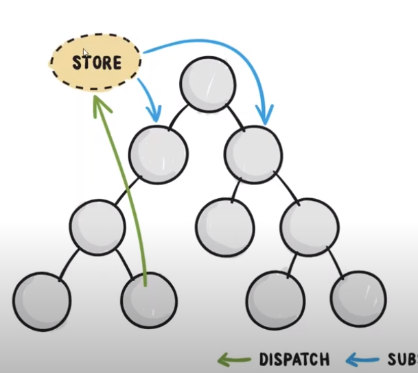

- > The stores can be thought of as a "middleman" for all state changes in the application. With redux involved, components don't communicate directly between each other, but rather all state changes must go through the single source of truth, the store.

- > For communication between two components that don't have a parent-child relationship, you can set up your own global event system. Flux pattern is one of the possible ways to arrange this.

- Parent and child we can use props. What if two components needs to communicate and their are not parent-
- child. Redux library help to communicate.

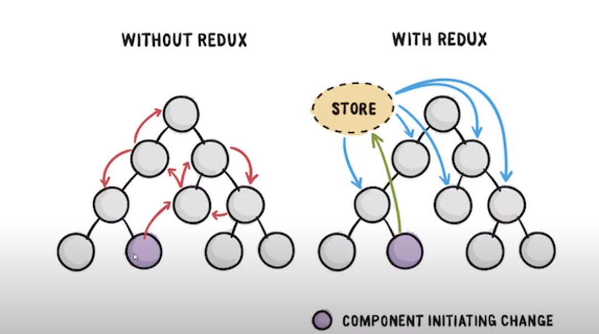

## Redux  Terminology

- Action : CRUD operation, create, read, update and delete
- Reducers : it wil execute the action. with the action triggered from view and current state. return = 
- new state
- Store : manage the state, heart of the redux. which actually store and guards your application state.
- we can subscribe to state changes in the store and dispatch action to it.
- Dispatch : If state changing dispatch.
- Connect : connect to react

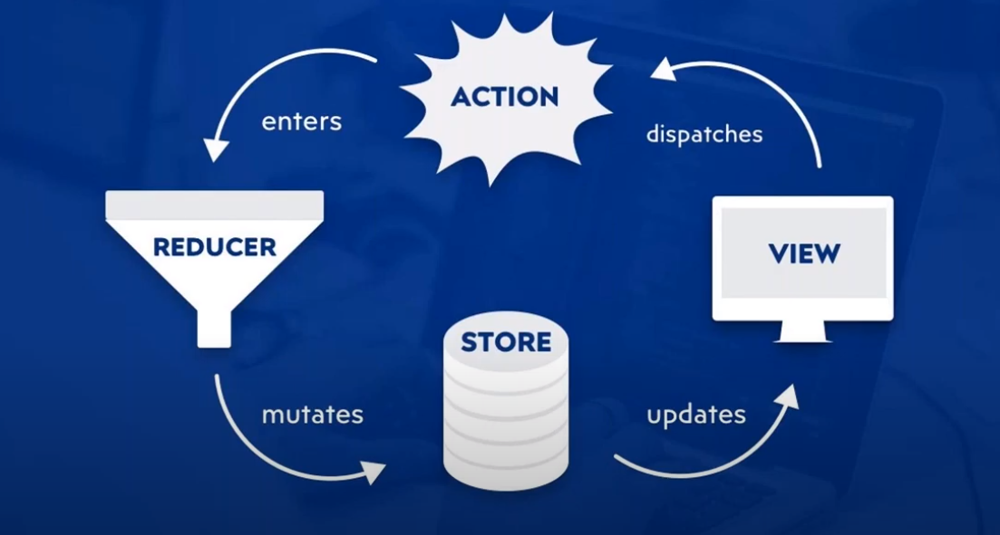

## Redux Store Methods

- getState() -> get current state. 
- dispatch(action) -> what type of actions
- subscribe(listener) -> adds a change listener.
- replaceReducer(nextReducer) -> multiple reducer doing different task.

- >  The state is empty, actioncreator gives the action to reducer. The action and current state combining, the new state created by reducer. reducer hands over the new state to the store. The store handsover to the action. 

## Creating React APP Using CLi

- npx create-react-app project-name
- Public, src and package.json file.
- when you change something in App.js automatically changes in the browser without reload. - Hot reload.
- Webpack tool maintain everything inside the json file. 
- You can change the configuration of the webpack with "run eject".
- Public folder - index.html -> 

 in this root we are going to mount our application.
- src -> index.js -> starting point of our application.
- ReactDOM.render(two arguments) - (JSX, DOM element) -> We are rendering this JSX into DOM.
- App.js is a functional component. 

## Props & Class component

- export default class Newcomponent extends React.Component{} - that class will act as react comp.
- There's a render function -> it's render the Html JS. return

- We need to import this component in APP.js
- html using attributes 
 => in react props. 
- In component we can access this property title. return 
{ this.props.name } 

- we extends the component from the react component, so we have also access to { this.props }
- When we passing html attribute in App.js in component getting that as an object with properties.
- So we can pass data from parent comp. App() -> child comp.
- To access variable name inside JSX with {name + "Kris"}
- React is consider all inside {} as JS. 

## Functional Component

- Functionalcomp.js -> using the component in app.js gives error. 
-  in the functional comp. babbel convert the 

 JSX into JS -> react.create.element it will created.
- react variable is missing -> error.
- When we using a component, we need to import react.
- In class component while we extending from react.Compenent, the child class get access to props and states.
- In functional class we didn't extending anything, so we giving Functionalcomp(props) as a argument.

## Event handling

- JSX expressions must have one parent element. 
- In functional component if we add 
 && <button>, two parent class -> solution: <>
<button></>
- empty tags => <> </> helps multiple DOM wrapping in one root element. 
- In old version of react using react.fragment tag doing same as empty tag.
- <button onClick={clicked}> -> const clicked = () in js inside (e) - the argument have clickevent details wrapped inside. 

- Event handling in class component. 
- when we click the function clicked called. In jS onclick() jsx onClick(). 
- alert(this) => Newcomponent class instance - object will alert. Because we run this program in stright mode running.
- this.clclicked connenct with the button this pointing on the button. - we get undefined - to solve this bind the class instance with the function. 
-  super() -> use to invoke constructor in React.Component 

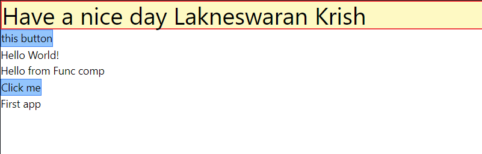

## State in class component

- data of the component. Every component have a state and based on that teh component how to render we'll deciding. 
- mutability = this.state.name = ; immutability => we applying new object Rather than copying that old object key and value.
- using spread operator to  copying current state. 

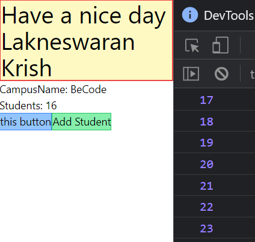

## state in functional component.

- we did't extend fro react.Component so this. is not available. -> to solve this we using useState.
- With using useState function inside func. comp. creating state and using that. 
- To call the useState useState("default value") 
- This function will return two value in Array form.
- ES6 D-stucture using getting the values, first = variable, getter this default value. second value = setter
- function.
- const [getter, setter] = useState("")

 
 ## Lifecycle hooks

 - Component in different stages executing different function calling Lifecycle hooks.
 - In human Life Birth working RIP, same component will create, update and destroy. 
 - Those function will automatic execute itself.
 - With using this we can decide how we change the component state or component rerender or not.
 - - Mounting:  
 -     - constructor()  - static getDerivedStateFromProps()    - render()          - componentDidMount()
 
 - - Updating:  
 -     - static getDerivedStateFromProps()  -  shouldComponentUpdate()  - render()  -getSnapshopBeforeUpdate()  - componentDidUpdate()   

 - - Unmounting:  
 -     - componentWillUnmount()                           
 
- Lifecycle hooks : componentDidMount() and componentWillUnmount 
- while component has created constructor will execute..
- ComponentDidMount() hooks uses inside this function required API calls, value changing, we can do that inside this.
- then teh state will update properly and rerender
- ComponentWillUnmount()  this function to destroy.
- component destroy means when removing in at The DOM tree.

- - This is constructor -> Render -> componentDidMount -> componentWillUnmount.

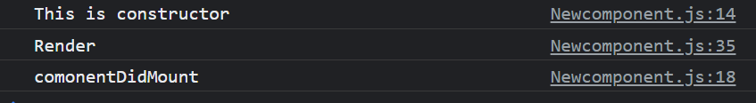

## UseEffect in functional Component

- We have used lifecycle hooks in class component. With help of useEffect function we have access to use lifecycle 
- hooks in functional component.
- Constructor in FC is what we wrote directly inside a function. const [] = useState()
- useEffect function inside will be componentDidMount appear => where api call and ajax.
- When we return a function in userEffect. then ill component destroy then it will execute 
- return () => componentWillUnmount.

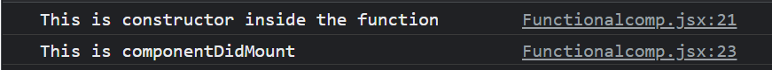

- useState, useEffect, use... Functions are starting with use are reactHooks. 
- The main purpose of reactHooks are USe functions that can used by FC.
- A useEffect function can equally compare with componentDidMount.
- UseEffect can accept two arguments. One is (function () => {} and second is a dependency array , []). 
- If dependency array is empty, the function will execute only once while component is creating. 
- useEffect can be reused, multiple times. 
- We can use the dependency array when any changes in the state. const [current, previous] = useState().

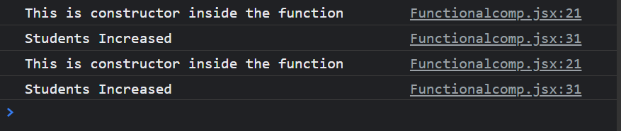

## Conditional rendering

- Can compare with if conditional, if value is this and render something. oR render something else.

## List & keys using map()

- The array prints in the string method.
- <ul> {bookContent.map(item => <li key={item}>{item}</li>)} </ul>
- With using builtin array function map() => we are creating new array. 
- For li we passing an attribute key, because we are looping the array bookContent.
- the values are unique, no-repeat from our code. if react, react => error. We give index, but not good 
- practice, if some element is removed, index will change and perform will effect. index and math random
- should nay use for keys.

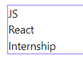

## Form handling

- In the form submitting execute submitForm. While the input value changing should the changeBookNameFunc
- execute. input value is bookName. 
- If change name button pressed, the behaviors to redirect to the same page self. 
- (e) => event the form details inside. 
- e.preventDefault(); -> stop the reload behaviors.
- We can't change the default name " react ", with  the help of setBookName -> change the value.
- setBookName(e.target.value) - target is the current input.

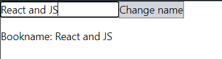

## useRef - reacthooks

- It will use when we need direct DOM accessing.  example: input focusing.
- How tio use useRef ? import useRef. give a default value by variable. 
- Pass that variable to where we want to ref. ref={inputEl} -> it's pointing the input tag.
- To access this -> Use this inside useEffect. There is input value available. 
- to access DOM -> inputEl.current.focus()

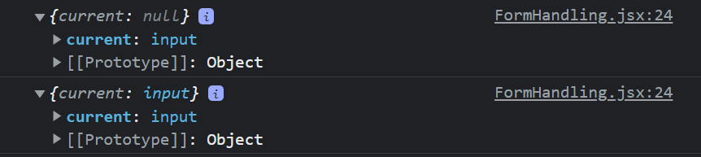
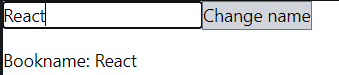

## use function in details

### useState

- inbuilt react hook, with using this hook we can add a state in FC. 
- We can only use hooks in FC, not in Class component.
- useState should execute in same order in every component render.
- use function should not execute in if, for statement. 
- const arr = useState(getter, setter ) -> E6 -> const [count, setCount]
- updateCount(){setCount(count + 1)setCount(count + 1)} => setcount twice exected still inc. 1
- because of closure. the value come from outerscope as 10 -> 10+1 =11 return each click. 
- react setter value update in batch. 
- To solve this method we using callback method. ((prevCount) => prevCount +1) twice inc. 2
- When state is modifying the entire component will rerender.
- If we use big calculation function passed to useState. it's execute each time while modifying the state.
- so make the function as call back function -> it will execute only once. -> performance improve a lot.
- object -> const [obj, setObj] = useState({a: 1, b: 2})
- return { a: prevObj.a + 1} -> when setObj called in this prevObj will entire object passed. 
- the default value passed. in this value we are inc. a by 1.
- h1 {obj.b} -> vanished, in class component when we return a it will merge, but in useState
- it will replace entire object. useState({a,b}) -> return a -> useState({a})
- solution spread operator return { ...obj, a: prevObj.a + 10} -> take first entire properties of obj. and 
- overwrite  only a: prevObj.a + 10.
- Second solution: use multiple useStates for a and b.

### useEffect

- To use LifeCycleHook in FC. componentDidMount, componentDidUpdate, componentWilUnmount
- syntax of useEffect (( =>{})) a call back function passing. -> if one callback func.
- whenever rerender the component callback function executing itself.
- solution, use dependency array. }, []). -> if empty array working as componnentdDIdMount lifecycle
- First time this FC created this useEffect will run. 
- passing something in dependency array like [val1] -> only run this effect while val1 change.
- working as componentDidUpdate.
- For API calling and fetching use ComponentDidMount. - only once fetch the data.
- https://jsonplaceholder.typicode.com/ -> fake apis
- > useEffect(()=>{  fetch('https://jsonplaceholder.typicode.com/todos/1')
  .then(response => response.json())
  .then(json => console.log(json)) }, [])

- [todo, setTodo] = useState({}) -> .then(json => setTodo(json)) we're passing out data to todo.
- {json.stringify(todo)} -> converting object into string. 
- Fecth in dynamic. [page]
- ComponentWillUnMount -in useEffect return a function.

### useMemo

- it's used to memorization a function -> can't do for all function, only for pure function.
- What is pure function? when we given an input, the output of that should be same as input.
- function sqrt(n {return n*n}). ANd this function won't create a side effect. 
- What is a side effect? When a function modifying variable from other scope.
- let x = 2 - function sqrt(n) {x=x*n} 
- When the value of arr change calculate this showMax().
- [...arr, Math.round(count * Math.random())] -> Taking the values of exiting array and add the random 
- value with count and push in the arr.
- use wisely, use for big calculation.

### useRef

- Access DOM directly, Persist a data when component rerender. we can use useRef.
- If value changing useRef won't rerender. 
- How to access DOM directly? const inputRef = useRef() -> <input ref={inputRef}> ref point connected.
- We can focus the input. 
- component rerender previous state to store. 

